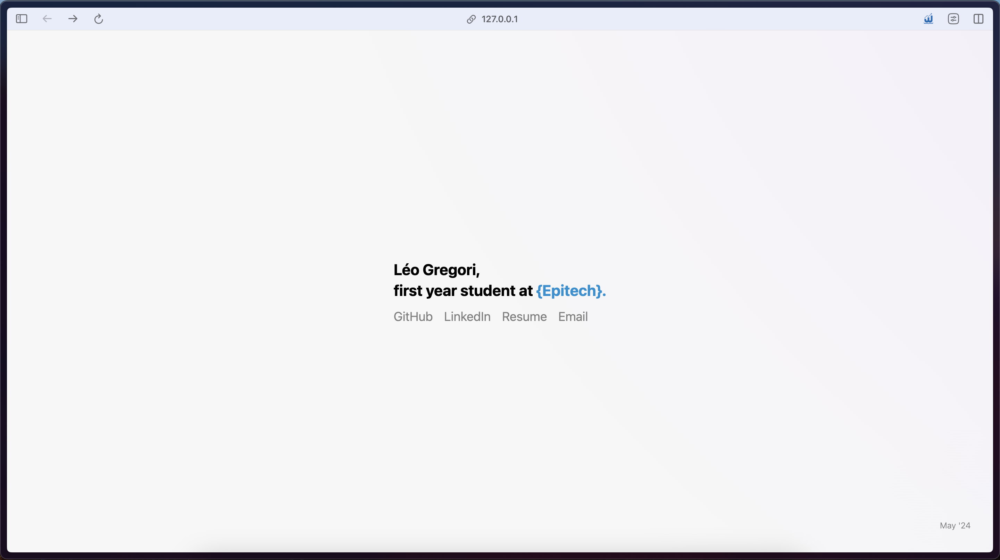
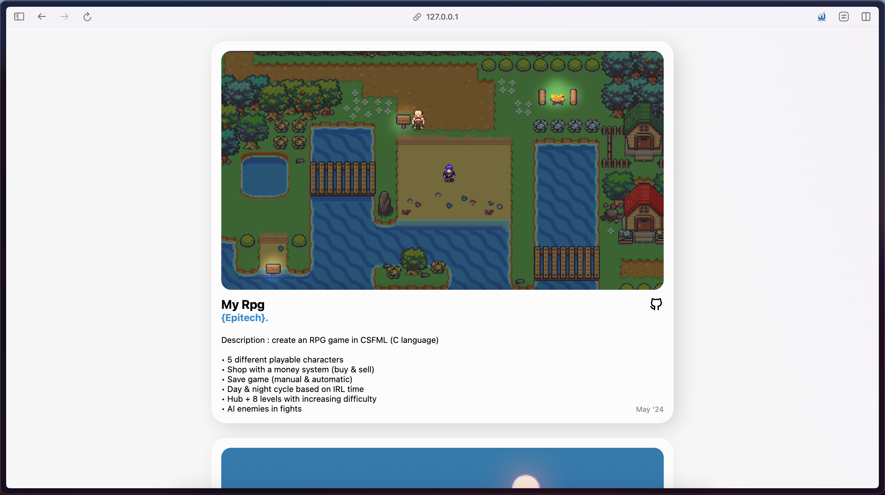
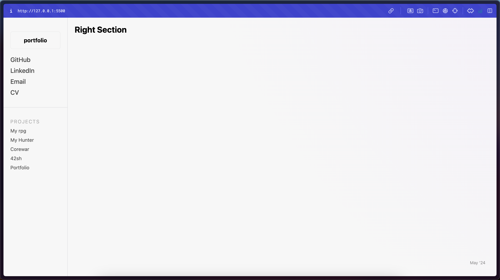

# [V.1.0.0](https://github.com/xmarano/portfolio/tree/12904349ec778a5d132d1db430e5d009fc2f67d2)

 

# [V.1.1.1](https://github.com/xmarano/portfolio/commit/34827da9b2754e12c4e7b71e8af9051aca733d19)
* Add description of projects
* Architecture of the code

 

# [V.1.1.2](https://github.com/xmarano/portfolio/commit/bd2c3ea0551c9f21473b8f7ea2d44c3b393e925a)

 

# [V.1.1.3](https://github.com/xmarano/portfolio/commit/34827da9b2754e12c4e7b71e8af9051aca733d19)
* Add Gitignore & Readme files

 

# [V.1.2.0](https://github.com/xmarano/portfolio/commit/bd2c3ea0551c9f21473b8f7ea2d44c3b393e925a)

